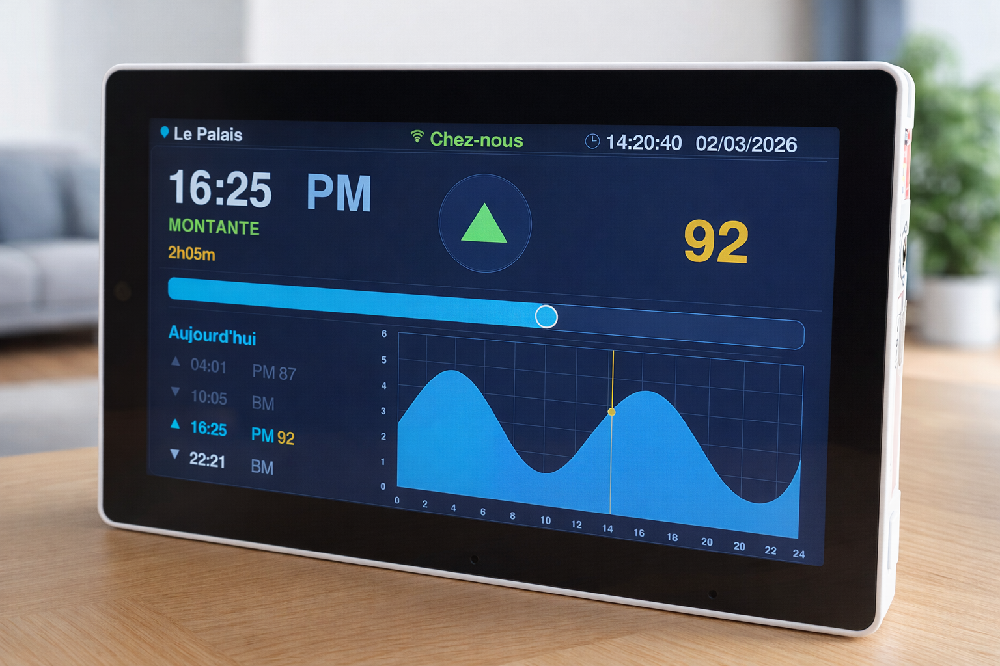

# Tides

> **Disclaimer:** This library is designed for **French Atlantic tidal stations only**. Results are approximations based on harmonic analysis and **do not replace official tide tables** published by the [SHOM](https://www.shom.fr) (Service Hydrographique et Océanographique de la Marine). Do not use this data for navigation or safety-critical purposes.

**Harmonic tidal prediction for ESP32** — computes high tide / low tide times, heights, and French tide coefficients using classical harmonic analysis.

Station data is compiled directly into the firmware; no SD card, SPIFFS, or LittleFS image is required. The library works identically in [Wokwi](https://wokwi.com) simulation and on real hardware.

## Display Example

M5Stack Tab5 live tide display with sinusoidal chart, real-time tide events, and French tide coefficients:



---

## Features

- Harmonic analysis based on the Doodson constituent table (~110 constituents)
- Nodal corrections (u / f functions) applied per day
- Returns up to 4 tidal events per day (time, height, high/low flag)
- French *coefficient de marée* calculated from the Brest reference station
- Built-in stations: **Le Palais** (Belle-Île-en-Mer) and **Brest**
- New stations added with a single `.cpp` file — no library modification needed
- Targets ESP32 (PlatformIO / Arduino framework)

---

## Installation

### PlatformIO Library Registry

Add to your `platformio.ini`:

```ini
lib_deps =
  perpective2410/Tides
  paulstoffregen/Time @ ^1.6.1
```

Or search for **`Tides`** in the [PlatformIO Library Registry](https://registry.platformio.org/libraries/perpective2410/Tides).

### Arduino Library Manager

Search for **`Tides`** in the Arduino IDE Library Manager (**Sketch → Include Library → Manage Libraries…**), or manually add the GitHub repository:

```ini
https://github.com/perpective2410/tide-projectio.git
```

Then copy an example sketch from the `examples/` folder:
- Open `examples/BelleIle_minimal/BelleIle_minimal.ino` in Arduino IDE, or
- Copy both `BelleIle_minimal.ino` and `StationConfig.h` to your sketch folder

---

## Quick Start

### 1. Configure Stations

Edit `StationConfig.h` in your sketch directory to select which stations to compile:

**PlatformIO:**
```cpp
// examples/BelleIle_minimal/StationConfig.h
#define INCLUDE_LE_PALAIS           // Belle-Île-en-Mer
#define INCLUDE_SAINT_MALO          // Brittany
// #define INCLUDE_SHEERNESS        // UK coast
```

**Arduino IDE:**
Create `StationConfig.h` in the same folder as your `.ino` sketch and add your station definitions.

Brest is **always included** by default as the reference station for French tide coefficients — you don't need to define it.

### 2. Use in Your Code

```cpp
#include <TimeLib.h>
#include "Tides.h"

void setup() {
    Serial.begin(115200);

    setStation("Le Palais");    // load station + Brest reference

    // calculate tides for today (UTC epoch from NTP / RTC)
    time_t today = /* your epoch source */ 0;
    TideInfo ti = tides(today);

    for (int i = 0; i < ti.numEvents; i++) {
        Serial.print(ti.events[i].isPeak ? "HM " : "BM ");
        Serial.print(ti.events[i].time, 2);   // decimal hours, local time
        Serial.print(" h  ");
        Serial.print(ti.events[i].amplitude, 2);
        Serial.println(" m");
    }

    Serial.print("AM coeff: "); Serial.println(ti.morningCoefficient);
    Serial.print("PM coeff: "); Serial.println(ti.afternoonCoefficient);
}
```

Complete examples are in [`examples/BelleIle_minimal/`](examples/BelleIle_minimal/) (static date, no WiFi) and [`examples/BelleIle_wifi/`](examples/BelleIle_wifi/) (WiFi + NTP, 4-day rolling forecast).

---

## Available Stations

The library includes **170+ French Atlantic tidal stations** with harmonic data sourced from the SHOM. Station names use underscores to replace spaces and hyphens.

**Examples:** `LE_PALAIS`, `SAINT_MALO`, `BOULOGNE_SUR_MER`, `SAINT_VAAST_LA_HOUGUE`

See `src/StationConfig.h` for the complete list of available stations.

### Memory Optimization

Only stations you explicitly enable in `StationConfig.h` are compiled into your firmware:
- **Brest:** ~8 KB (always included as the coefficient reference)
- **Other stations:** ~5–15 KB each (depending on harmonic complexity)

Example configurations:
- **Minimal** (1 station): ~13 KB
- **Coastal** (5 stations): ~40–60 KB
- **Comprehensive** (20+ stations): ~150–250 KB

This selective compilation is essential for small boards with limited flash memory (e.g., ESP32 with < 1 MB usable space).

---

## API

### Initialisation

```cpp
bool setStation(const char* id);
```
Load a station by name. Brest is loaded automatically as the coefficient reference.
Returns `false` if the station id is not found in the registry.

### Calculation

```cpp
TideInfo tides(time_t epoch);
```
Compute tidal events for the calendar day that contains `epoch` (UTC Unix timestamp).

```cpp
TideInfo tides(int year, int month, int day);
```
Convenience overload — equivalent to calling `tides()` with noon UTC on the given date.

### Data structures

```cpp
struct TideEvent {
    double amplitude;  // water height in metres
    float  time;       // local time, decimal hours (e.g. 14.5 = 14 h 30)
    bool   isPeak;     // true = high tide, false = low tide
};

struct TideInfo {
    TideEvent events[4];          // ordered by time
    int       numEvents;          // 3 or 4 in normal semi-diurnal conditions
    int       morningCoefficient; // French coeff for the first tidal cycle
    int       afternoonCoefficient;
    time_t    epoch;              // the UTC epoch passed to tides()

    float getEventTime(int index) const;
};
```

### Rolling forecast window

```cpp
TideStack stack(4);          // hold 4 days

TideInfo ti = tides(epoch);
stack.push(ti);              // oldest day shifts out automatically

const TideInfo& day0 = stack.peek(0);  // oldest day still in window
const TideInfo& day3 = stack.peek(3);  // newest day
```

### Utility

```cpp
int getFranceTimezoneOffset(time_t epoch);
// Returns 60 (winter CET) or 120 (summer CEST) minutes.
```

---

## Adding a New Station

1. **Create** `src/stations/MyCity.cpp` — copy `LePalais.cpp` as a template and fill in the harmonic constituents (amplitude in metres, phase in degrees, referred to GMT):

```cpp
#include "StationDef.h"

static const HarmonicConst HARMONICS[] = {
    { "M2",  1.234,  98.5 },
    { "S2",  0.456, 130.2 },
    // … add as many constituents as available
};

extern const StationDef STATION_MY_CITY = {
    "My City",
    3.1,   // Z0 datum offset (m)
    0.0,   // refLow  (reserved)
    0.0,   // refHigh (reserved, only meaningful for the Brest reference)
    HARMONICS,
    (int)(sizeof(HARMONICS) / sizeof(HARMONICS[0]))
};
```

2. **Register** in `StationRegistry.cpp` — add an `extern` declaration in the conditional block and add to the REGISTRY array (the file has a template for this):

```cpp
#ifdef INCLUDE_MY_CITY
extern const StationDef STATION_MY_CITY;
#endif

const StationDef* const REGISTRY[] = {
#ifdef INCLUDE_MY_CITY
    &STATION_MY_CITY,
#endif
};
```

3. **Enable** in your `StationConfig.h`:

```cpp
#define INCLUDE_MY_CITY
```

4. **Use** it in your sketch:

```cpp
setStation("My City");
```

**Notes:**
- Constituent names must match entries in `src/TideHarmonics.cpp` (the Doodson table). Names are case-sensitive.
- Station names in `StationDef` must match the station id used in `setStation()`.
- Only stations you `#define` in `StationConfig.h` are compiled into the firmware, saving memory.

---

## Wokwi Simulation

Open the project in VS Code with the [Wokwi extension](https://marketplace.visualstudio.com/items?itemName=wokwi.wokwi-vscode), press **F1** and select **Wokwi: Start Simulator**. No filesystem image is needed — all station data is compiled into the firmware.

---

## Project Structure

```
src/
  Tides.h / Tides.cpp              — public API and calculation engine
  TideHarmonics.h / .cpp           — nodal correction functions and constituent table
  StationConfig.h                  — template configuration file (fallback if not in sketch dir)
  stations/
    StationDef.h                   — HarmonicConst / StationDef structs
    LePalais.cpp                   — Le Palais (Belle-Île-en-Mer) station data
    Brest.cpp                      — Brest reference station data
    *.cpp                          — 168+ additional station definitions
    StationRegistry.cpp            — conditional registry and findStation() lookup
examples/
  BelleIle_minimal/
    BelleIle_minimal.ino           — static date, no WiFi (works in both PlatformIO and Arduino IDE)
    StationConfig.h                — station selection for this example
  BelleIle_wifi/
    BelleIle_wifi.ino              — WiFi + NTP, 4-day rolling forecast (works in both PlatformIO and Arduino IDE)
    StationConfig.h                — station selection for this example
platformio.ini                     — build configuration
library.properties                 — Arduino Library Manager metadata
```

**Configuration:**
- `StationConfig.h` in your sketch directory (PlatformIO examples or Arduino IDE sketch folder) controls which stations are compiled.
- If no `StationConfig.h` is found, only **Brest** is compiled (default fallback).
- See `src/StationConfig.h` for documentation on available stations.

---

## Dependencies

| Library | Version | Purpose |
|---------|---------|---------|
| [paulstoffregen/Time](https://github.com/PaulStoffregen/Time) | ≥ 1.6.1 | `time_t`, `breakTime()`, `makeTime()` |

The NTPClient library is used in the example sketch only; it is not a library dependency.

---

## Platforms

Tested on **ESP32** (Xtensa LX6, Arduino framework via PlatformIO).
The harmonic engine has no hardware-specific dependencies and should port to other platforms with a C++11 compiler and the Arduino `Time` library.

---

## Contributing

Contributions are welcome, especially **new station data**.

If you have harmonic constituent data for a French tidal station (amplitude in metres and phase in degrees GMT, sourced from the SHOM or equivalent official authority), you can add it to the library by following the steps in [Adding a New Station](#adding-a-new-station) above and opening a pull request.

When contributing a station, please include:
- The station name as it appears in official SHOM publications
- The source of the harmonic data (e.g. SHOM tide table year, dataset URL)
- The Z0 datum offset in metres

Bug reports and corrections to existing station data are equally appreciated — open an issue on GitHub.

---

## License

[MIT](LICENSE) — © 2026 Florent Valdelievre
